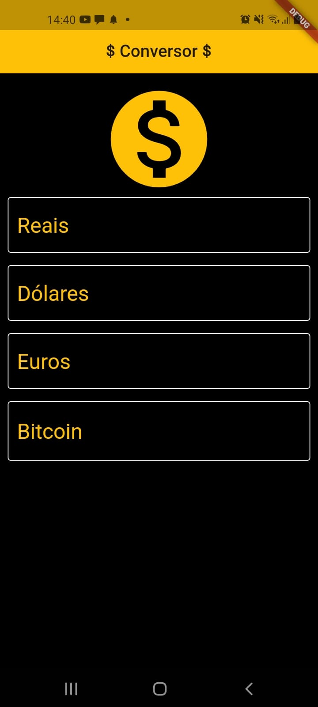
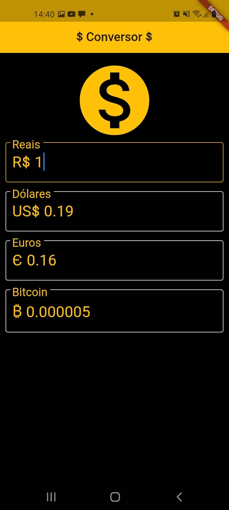

# Conversor de Moedas

Conversor de moedas(Dólar, Real, Euro e Bitcoin).

## Screenshot

Clone do projeto e executar o comando <b>flutter run</b>

Será gerado o build da aplicação flutter.

Adicionado o valor 1 real.

